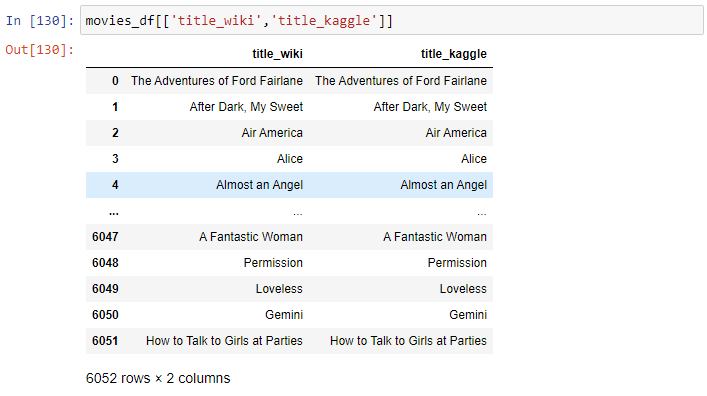
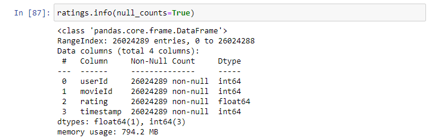

# Movies-ETL

### Overview / Results
  - This week I worked with Britta to prepare for an event called "Hackathon" in which teams of analyst work together on a project using data tyo solve a specific problem. I am helping Britta gather data from Wikipedia and Kaggle to combine them and save in a SQL database. We are combining the data into one place so it is easy for the teams to access while competing. Before we combine the data sets I am to clean the files so that the eams  do not have to waste any precious time while competing in the event.  
  - Below are a couple of examples o nthe sheer volume of data we are working with this week. As you can see it is quite a bit! But no worries once it is all parced through and we removed much of the bad formatting from the raw files and organised it into a readable set of data the size isn't so daunting. 
  
                                               
  
  - In conclusion working with two data sets from different websites was challenging at first but once combined I found it much more accessible and straight forward when it came to the actual code. I ran into far less errors this week that I ran into over the last couple of weeks on different projects. This weeks project went smoothly and I was able to finish in a timely matter.
